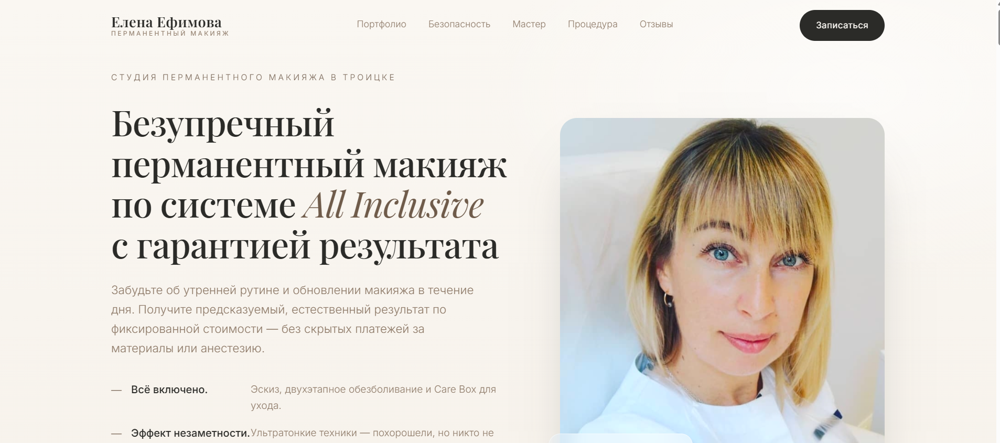

Лендинг для мастера перманентного макияжа — продающий лендинг для мастера перманентного макияжа
Одностраничный сайт, построенный вокруг трёх ключевых УТП: прозрачное ценообразование (система «всё включено»), ультратонкие техники с эффектом незаметности и личная гарантия мастера на 1,5 года. Лендинг ведёт посетителя от первого впечатления до записи на процедуру через последовательное снятие возражений, демонстрацию экспертизы и социальные доказательства.
 
1.  Какая задача решается
- Привлечение и конверсия. (Два CTA-кнопки на первом экране + финальный блок с прямыми ссылками на WhatsApp и телефон)
- Отстройка от конкурентов. (Три тезиса-УТП вынесены в первый экран до скролла — посетитель сразу видит отличие)
- Снятие страхов и возражений. (Отдельный блок «Ваши сомнения и мои решения» закрывает три главных страха: неестественный результат, боль, скрытые доплаты)
- Формирование доверия. (Блоки «Безопасность и стерильность» и «Знакомство с мастером» с конкретными фактами (медобразование, 10+ лет, 30+ обученных специалистов)
- Прозрачность ценообразования. (Каталог с фиксированными ценами и расшифровкой, что входит в стоимость)
- Демонстрация результата. (Блок портфолио «До/После» + три развёрнутых отзыва с живыми деталями)
2.  Для кого сделан проект
- Целевая аудитория: женщины 15–70 лет, которые:
- Устали от ежедневного макияжа и хотят экономить время по утрам
- Боятся неестественного результата («синие брови», «кукольные губы»)
- Переживали негативный опыт или слышали негативные истории о татуаже
- Ценят прозрачность и не хотят столкнуться с доплатами в процессе
- Ищут мастера с медицинским бэкграундом и подтверждённой экспертизой
3.  Основные функции / стек
Структура лендинга (8 смысловых блоков):
1.	Первый экран (Hero) — заголовок H1 с оффером, подзаголовок H2 с выгодой, 3 буллита-УТП, CTA-кнопка
2.	Боли и решения — 3 типичных страха клиентки → конкретный ответ мастера на каждый
3.	Каталог услуг и цены — 5 позиций с фиксированной стоимостью и расшифровкой состава услуги
4.	Портфолио «До/После» — placeholder под фотографии работ (брови, губы, веки)
5.	Безопасность и стерильность — одноразовые расходники, автоклав, сертифицированные пигменты
6.	Знакомство с мастером — краткая биография Елены (медобразование, 10+ лет, 30+ учеников)
7.	Как проходит процедура — 5 пошаговых этапов от консультации до выдачи Care Box
8.	Отзывы + финальный CTA — 3 отзыва с деталями, адрес, телефон, Instagram, две кнопки действия
Функциональные элементы:
•	CTA-кнопки: «Записаться на консультацию и эскиз», «Выбрать услугу и забронировать время», «Написать в WhatsApp», «Позвонить мастеру»
•	Контактный блок: адрес, телефон (+7-966-011-64-47), Instagram (@elena_efimova_permanent)
•	Якорная навигация (рекомендуется при вёрстке): меню с быстрым переходом к прайсу, портфолио, отзывам

•  Как запустить
1.	Зарегистрироваться на Tilda.cc
2.	Создать проект → выбрать шаблон из категории «Бьюти / Услуги»
3.	Скопировать тексты из каждого блока лендинга в соответствующие секции
4.	Загрузить фотографии «До/После» в блок портфолио
5.	Настроить кнопки: WhatsApp-ссылка (https://wa.me/79660116447), tel:+79660116447
6.	Подключить домен и опубликовать

•  Скриншоты или ссылка на живой проект
https://elena-permanent.ru

